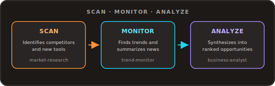

<h1 align="center">AI Market Research Agent</h1>

<p align="center">
  An AI agent automation workflow that scans an industry or niche for competitor moves, emerging trends, and new tools.<br/>
  Get a single ranked report of recommended opportunities, built on Zo Computer and compatible with Claude AI.
</p>

<p align="center">
   
</p>

<p align="center">
  
</p>

<p align="center">
   
</p>
<p align="center">
   
</p>
<p align="center">
   
</p>
<p align="center">
  
</p>

## Table of Contents

- [Overview](#overview)
- [Features](#features)
- [Requirements](#requirements)
- [Installation](#installation)
- [Configuration](#configuration)
- [Usage](#usage)
- [Folder Structure](#folder-structure)

## Overview

Get a fast, ongoing read on any industry or niche with minimal effort. This AI agent automation workflow runs a three-stage pipeline: it scans for relevant competitors and new tools/products entering the space, monitors for emerging trends and recent industry news, then analyzes both into one report, a plain-language recap and a short, prioritized list of recommended opportunities, each traceable to a specific finding. Runs entirely on free, built-in Zo Computer tools, no paid competitive-intelligence, trend-tracking, or market-data API required. Every skill is also compatible with Claude AI or any agentic framework, not just Zo's own routing.

## Features

| Skill | What it does |
| --- | --- |
| `market-research` | Identifies/monitors competitors in the niche via `web_research`/`web_search`/`x_search`, checks each for recent moves, and separately scans for new tools/products entering the space. |
| `trend-monitor` | Scans recent news (`web_search` with `topic="news"`) and social discourse (`x_search`) to surface emerging trends (each backed by 2+ sources) and a plain-language news summary. |
| `business-analyst` | Synthesizes the market scan and trends/news into one report: a recap plus a prioritized list of recommended opportunities, each traceable to a specific competitor move, trend, or news item. |

## Requirements

- Built-in web tools only: `web_search`, `web_research`, `x_search`, `read_webpage`/`view_webpage`/`open_webpage`. No setup needed.
- No integration, API key, or paid third-party service is required or supported. This pipeline never calls a paid competitive-intelligence, trend-tracking, or market-data API.

## Installation

### Fast path (recommended)

1. Open a **new Zo chat**.
2. Paste the entire contents of `installation-prompt.md` from this repo, with the repo URL filled in (it defaults to `https://github.com/robort-gabriel/ai-market-research-agent`, swap it if you're installing from a fork).
3. Send it. The AI will fetch this repo into `Zo-Automations/ai-market-research-agent/` on your Zo, verify the three skills, help you fill in `config/research-topic.md`, create a dedicated "AI Market Research Agent" persona scoped to this project, and ask whether to run the pipeline ad hoc and/or schedule it as a recurring automation, confirming with you before creating anything that runs unsupervised.

This is the whole install: no packages, no build step, no API keys.

### Manual path

If you'd rather install by hand:

1. Clone or download this repo.
2. Copy the whole folder into your Zo workspace at `/home/workspace/Zo-Automations/ai-market-research-agent/`, preserving the structure below. The three skills must stay project-local at `Skills/market-research/`, `Skills/trend-monitor/`, `Skills/business-analyst/`, they are not installed globally, and moving them elsewhere breaks the project's scoping.
3. Edit `config/research-topic.md` and replace the placeholder example with your real industry/niche, optionally known competitors and focus areas.
4. (Optional) In a chat, ask Zo to create a persona for this project using the exact text in `persona.md` so you don't have to restate the pipeline every time.
5. Try it: paste one of the examples from `starter-prompts.md` into a chat.

### Claude AI path

The three skills (`market-research`, `trend-monitor`, `business-analyst`) are plain `SKILL.md` files with no Zo-specific dependencies, so they also run under Claude AI:

1. Copy the `Skills/market-research/`, `Skills/trend-monitor/`, and `Skills/business-analyst/` folders into wherever your Claude AI setup reads skills/instructions from (e.g. a project folder for Claude Code, or attached as reference files in Claude Desktop/the Anthropic API).
2. Give Claude AI the same three stages in order, using `config/research-topic.md` and `automation-prompt.md` as the inputs/instructions, and file-based handoff between stages (see Usage below) instead of Zo's built-in tools for web reads/searches.
3. No API key or extra sign-up beyond your existing Claude AI access is required.

## Configuration

No secrets required. Per-run parameters, passed stage to stage:

| Parameter | Required | Default | Used by |
| --- | --- | --- | --- |
| `niche` | Yes (or set in `config/research-topic.md`) | - | all three skills |
| `topic_file` | No | `config/research-topic.md` | `market-research` / `trend-monitor` |
| `run_date` | No | today's date | all three skills |
| `notify` | No | `none` (`email` also supported) | `business-analyst` / automation |

## Usage

**Ad hoc:** ask for each stage in sequence, or ask for the full pipeline in one request (see `starter-prompts.md`). The stages hand off through files:

```
market-research   -> Content/Market-Research/<niche-slug>/<date>/market-scan.md
trend-monitor      -> Content/Market-Research/<niche-slug>/<date>/trends-news.md
business-analyst   -> Content/Market-Research/<niche-slug>/<date>.md
```

**Recurring:** create a scheduled agent using `automation-prompt.md` as the instructions, with `niche` and `notify` set as preferred and a frequency of your choice (e.g. weekly). Scheduling a recurring agent is not done automatically by this project, confirm the niche and frequency explicitly, since each run is a full Zo session.

## Folder Structure

```
Zo-Automations/ai-market-research-agent/
├── README.md
├── installation-prompt.md            # paste into a new chat to auto-install everything
├── persona.md                        # exact text for the dedicated "AI Market Research Agent" persona
├── automation-prompt.md              # instructions for the scheduled agent
├── starter-prompts.md                # example prompts
├── config/
│   └── research-topic.md             # editable niche, known competitors, and focus areas
├── assets/
│   ├── pipeline-diagram.svg          # README header pipeline diagram
│   ├── zo-logo.png                   # Zo Computer logo used in this README
│   └── claude-logo.png               # Claude AI logo used in this README
└── Skills/
    ├── market-research/
    │   └── SKILL.md
    ├── trend-monitor/
    │   └── SKILL.md
    └── business-analyst/
        ├── SKILL.md
        └── references/
            └── output-template.md    # final report template
```
